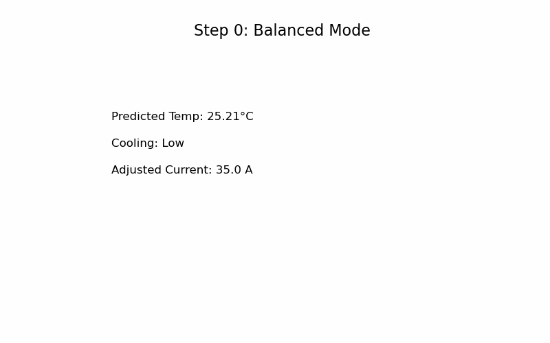
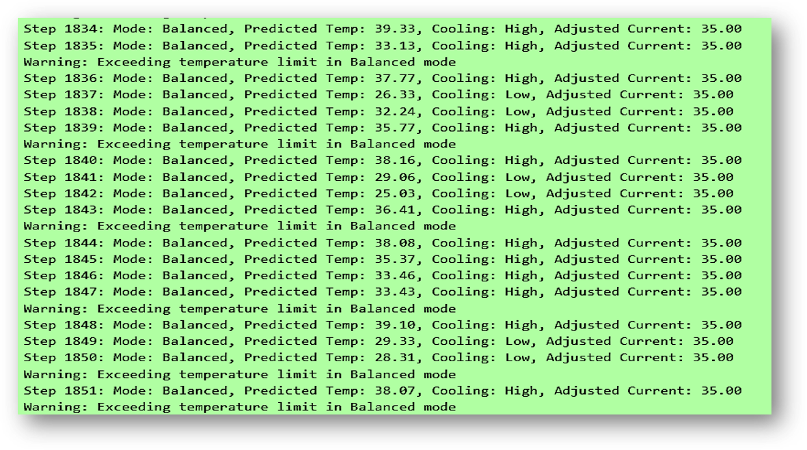

# 🚀 **AI Battery Management System (AI BMS) – Battery Performance Optimization**

[](https://www.python.org/)
[](#)
[](LICENSE)
[](#)

---

## 🌟 **Project Overview**
This project is part of the **AI Battery Management System (AI BMS)** initiative. The goal is to develop a **real-time mode selection interface** that allows users to optimize battery performance, efficiency, and longevity. 

Users can choose between several operational modes, including:
- **⚡ Performance Mode**
- **🌱 Eco Mode**
- **⚖️ Balanced Mode**
- **🛠️ Custom Mode**

Modes dynamically adjust parameters such as **cooling**, **fan speed**, and **temperature settings**.

---

## 📊 User Interface Prototype

Below is a prototype of the **AI Battery Management System (AI BMS)** optimization interface:


### Key Features of the Interface:

1. **Mode Selection**:
   - Users can choose between:
     - ⚡ **Performance Mode**: Maximize performance at the potential expense of battery life.
     - 🌱 **Eco Mode**: Optimize energy efficiency and extend battery life.
     - ⚖️ **Balanced Mode**: A middle ground between performance and efficiency.
     - 🛠️ **Custom Mode**: Configure user-defined parameters.

2. **Custom Mode Settings**:
   - Options to adjust:
     - **Cooling Mode** (Normal, Silent, Aggressive)
     - **Fan Speed** via slider
     - **Flow Rate** via slider
     - **Temperature Threshold** via slider
   - Enable/Disable advanced settings:
     - ✅ Overheat Protection
     - ✅ Fast Charging

3. **Impact Visualizations**:
   - **Performance Impact**: Bar chart showing mode-specific performance effects.
   - **Efficiency Impact**: Highlights energy efficiency in each mode.
   - **Longevity Impact**: Demonstrates how modes affect battery lifespan.

4. **Interactive Controls**:
   - **Apply, Save, Cancel** buttons for user actions.
   - Real-time visualization of the selected mode's impact.

---

## ✨ **Features**
- 🔄 **Mode Switching**: Users can select operational modes that dynamically adjust system parameters like fan speed and cooling temperature.
- 🛠️ **Custom Mode**: Users can personalize parameters such as fan speed and temperature thresholds, and see real-time effects on battery performance.
- 📈 **Dynamic Updates**: Real-time graphs display the impact of mode changes on performance, efficiency, and battery longevity.
- 🤖 **Auto Adjustments**: AI models automatically switch modes based on operating conditions.
- 🚗 **Applications**: Used in **electric vehicles** and **energy storage systems** to optimize battery performance in real time.

---

## 🛠️ **Technologies Used**
- **Programming Language**: 🐍 Python
- **GUI Framework**: PyQt5 / Tkinter
- **Real-time Visualization**: Matplotlib 📊
- **AI Models**: SOC estimation and temperature prediction using LSTM
- **Data Handling**: Pandas, NumPy

---

## 🔄 AI-Based Mode Selection

In this project, we replaced the static threshold-based mode selection logic with a **Machine Learning (ML)** model. The ML model dynamically selects the optimal mode (**Performance**, **Eco**, or **Balanced**) based on real-time battery conditions, including **SOC (State of Charge)**, **temperature**, and **current**.

### 📊 Data for Mode Selection

The training dataset for the mode selection model includes the following key features:

| **Feature**       | **Description**                               |
|--------------------|-----------------------------------------------|
| `SOC`             | State of Charge (%)                          |
| `Temperature`     | Predicted battery temperature (°C)           |
| `Current`         | Current draw (A)                             |
| `CoolingIntensity`| Required cooling intensity (e.g., Low/High)  |
| `Mode`            | Target mode (`Performance`, `Eco`, `Balanced`)|

Here’s a snapshot of the data used to train the mode selection model:


| **SOC (%)** | **Temperature (°C)** | **Current (A)** | **Fan Speed (RPM)** | **Mode**       |
|-------------|-----------------------|-----------------|----------------------|----------------|
| 82          | 34.5                 | 45              | 3000                | Performance    |
| 60          | 30.2                 | -20             | 1200                | Eco            |
| 72          | 31.8                 | 30              | 2000                | Balanced       |
| 85          | 37.2                 | 50              | 3200                | Performance    |
| 68          | 28.0                 | -15             | 1000                | Eco            |
| 70          | 32.0                 | 35              | 2200                | Balanced       |
| 75          | 33.5                 | -25             | 1500                | Eco            |
| 55          | 27.5                 | -18             | 1000                | Eco            |
| 78          | 35.8                 | 42              | 2800                | Performance    |
| 88          | 38.0                 | 55              | 3500                | Performance    |

---

### 📋 **Legend**

- **SOC (%)**: State of Charge of the battery (in percentage).
- **Temperature (°C)**: Battery temperature in Celsius.
- **Current (A)**: Positive values represent discharging; negative values represent charging.
- **Fan Speed (RPM)**: Cooling system's fan speed in revolutions per minute.
- **Mode**:
  - **Performance**: Optimized for high power output.
  - **Eco**: Focused on energy efficiency and longevity.
  - **Balanced**: A middle ground between performance and efficiency.

---

### 🛠️ How the AI Model Works
1. **Input Features**: The model takes SOC, temperature, and current as input.
2. **Prediction**: Based on historical training data, the model predicts the optimal mode.
3. **Dynamic Adjustments**:
   - Cooling intensity and current are adjusted dynamically based on the selected mode.
   - Warnings are generated for exceeding critical thresholds.

---

### 📈 Advantages of AI-Based Mode Selection
- **Dynamic Decision-Making**: The model adapts to real-time battery conditions for optimal performance.
- **Proactive Adjustments**: Predicts potential issues and makes adjustments before they occur.
- **Improved Efficiency**: Balances battery performance, efficiency, and longevity better than static thresholds.

---

### 🤖 **Machine Learning Integration**

This project utilizes **Machine Learning (ML)** for **intelligent mode selection**, leveraging a cutting-edge **Gradient Boosting Model (GBM)** for dynamic decision-making. The model predicts the optimal operational mode—**Performance**, **Eco**, or **Balanced**—based on real-time battery conditions.

#### 📊 **Data Utilization**
The dataset used for training includes the following features:
- **SOC (State of Charge)**: Battery's charge percentage.
- **Temperature (°C)**: Real-time battery temperature.
- **Current (A)**: Positive for discharging, negative for charging.
- **Fan Speed (RPM)**: Cooling system's operational speed.
- **Mode (Target)**: Labeled modes (`Performance`, `Eco`, `Balanced`) optimized for specific conditions.

#### 🛠️ **Mode Selection Model Training**
1. **Objective**:
   - Train a supervised classification model to dynamically select the optimal mode based on real-time battery data.
2. **Algorithm**:
   - **XGBoost (Extreme Gradient Boosting)** was chosen for its speed, accuracy, and ability to handle complex, non-linear data relationships.
3. **Training Process**:
   - A labeled dataset with historical battery conditions was used to train the model.
   - The model's hyperparameters were tuned using **grid search** to achieve optimal performance.
4. **Outcome**:
   - The XGBoost model achieved high accuracy in predicting the best mode for various battery conditions.
   - Feature importance analysis revealed that **Temperature** and **SOC** are the most influential factors.

#### 🚀 **Real-Time Integration**
- The trained XGBoost model is integrated into the system to process real-time battery data and predict the best mode on the fly.
- Based on the selected mode:
  - **Cooling intensity** and **current limits** are dynamically adjusted.
  - **Warnings** are triggered when critical thresholds (e.g., temperature limits) are exceeded.

#### 🔍 **Benefits of ML-Based Mode Selection**
- **Dynamic Adjustments**: Modes adapt intelligently to match real-time battery conditions.
- **Optimized Performance**: Balances high power output, energy efficiency, and battery health.
- **High Predictive Accuracy**: XGBoost provides robust and reliable predictions even with complex datasets.

By leveraging a **state-of-the-art Gradient Boosting Model**, this project achieves smarter and more adaptive battery management, empowering users with seamless and efficient operation.

---

#### 📊 **Feature Importance**

Below is a bar chart showing the importance of each feature used in the mode selection model:


#### 🎯 **Decision Boundary Visualization**

The scatter plot below illustrates how the model predicts modes based on SOC and Temperature:


### 📊 **Analyzing the Plots**

#### **1. Feature Importance Plot**
- **Temperature**: Most critical factor for mode selection, influencing cooling and performance decisions.
- **SOC (State of Charge)**: Second most important, reflecting the battery's charge level and its effect on mode choice.
- **Current**: Moderately significant, affecting charging and discharging scenarios.
- **Fan Speed**: Least significant, possibly an indirect predictor.

**Insight**: Focus on improving data quality for **Temperature** and **SOC**, and consider simplifying the model by removing less significant features like **Fan Speed**.

---

#### **2. Decision Boundary Visualization**
- **Regions**:
  - **Pink**: Performance Mode.
  - **Green**: Eco Mode.
  - **Blue**: Balanced Mode.
- **Observations**:
  - Clear separation between regions indicates effective classification.
  - Slight overlap near boundaries may lead to edge case misclassifications.

**Insight**: Optimize the model (e.g., hyperparameter tuning) to improve boundary handling and test with real-world data to ensure robustness.

---

These analyses confirm the importance of the features and demonstrate the model's classification accuracy, reinforcing the ML-driven approach for mode selection.

---

### 🖼️ Visualization
Below is a **snapshot** of real-time output based on AI-driven mode selection:



---

## 📂 **Project Structure**
```plaintext
AI_BMS_Optimization/
│
├── data/               # Data storage
│   ├── raw/            # Raw input data
│   ├── processed/      # Preprocessed data ready for use
│   └── sample_input.csv # Example data for testing
│
├── src/                # Source code
│   ├── gui.py          # GUI implementation (PyQt/Tkinter)
│   ├── real_time_mode_switching.py # Core script for mode switching
│   ├── models.py       # Includes SOC and temperature prediction models
│   ├── utils.py        # Helper functions (e.g., data preprocessing)
│
├── docs/               # Documentation
│   └── README.md       # Description, usage, and instructions
│
├── tests/              # Test scripts
│   ├── test_models.py  # Unit tests for SOC and temperature models
│
├── requirements.txt    # Dependencies
└── .gitignore          # Ignore unnecessary files
```

### 🔄 **Modes**

| **Mode**            | **Description**                                                                                  |
|----------------------|--------------------------------------------------------------------------------------------------|
| ⚡ **Performance**   | Prioritizes maximum battery performance by increasing cooling and fan speed, potentially reducing battery lifespan. |
| 🌱 **Eco**           | Focuses on battery longevity and energy efficiency by lowering cooling intensity and regulating power usage. |
| ⚖️ **Balanced**      | Strikes a balance between performance and efficiency with moderate cooling and power settings.    |
| 🛠️ **Custom**        | Empowers users to define parameters like fan speed and cooling thresholds, observing real-time effects. |

---

### 🧠 **How It Works**

1. **Real-Time Data Collection**:
   - The system continuously monitors and collects real-time battery parameters, including:
     - 🌡️ **Temperature**
     - ⚡ **Voltage**
     - 🔋 **SOC (State of Charge)**
     - 🔄 **Current**
     - 🌬️ **Fan Speed**
     - 💧 **Pump Duty Cycle**

2. **AI-Powered Predictions**:
   - AI models predict key battery metrics such as:
     - SOC (State of Charge)
     - Temperature trends
   - Predictions help dynamically optimize battery performance and longevity.

3. **Interactive Graphical Interface**:
   - The GUI, built with **PyQt5/Tkinter**, allows users to:
     - Seamlessly switch between modes.
     - Visualize real-time impacts on battery performance via dynamic Matplotlib plots.

---

### 🤖 **Dynamic Mode Switching**

- **AI-Driven Adjustments**:
  - The system automatically adjusts cooling intensity, fan speed, and other parameters based on:
    - The **selected mode** (Performance, Eco, Balanced, or Custom).
    - **Predicted SOC and temperature** from AI models.
  
- **Custom Mode**:
  - Users can manually fine-tune settings like cooling thresholds and fan speeds.
  - The system provides real-time feedback to help users evaluate their custom configurations.


### 🚀 Installation
To set up the project locally, follow these steps:

1. Clone the repository:

`git clone https://github.com/yasirusama61/AI_BMS_Optimization.git`
`cd AI_BMS_Optimization`

2. Install the dependencies 

`pip install -r requirements.txt`

3. **Run the GUI**: To start the GUI for the mode selection interface, run:

`python src/gui.py`

### Data Used
- **Battery Operation Data**: Voltage, Current, SOC, Temperature, Pump Duty Cycle, and Fan Speed.
- **Environmental Data**: Ambient temperature data (Tx) to dynamically adjust system performance.
- **Historical Performance Data**: Used to train the AI models on performance metrics under different conditions.


## 📊 Real-Time Output Example

The AI Battery Management System (AI BMS) provides real-time predictions and dynamically adjusts battery parameters based on the selected mode. Below is an example of the output generated during a simulation:

### 🔍 **Highlighted Output**

- **Mode**: Balanced
- **Predicted Temperature (°C)**: Real-time temperature predictions using the AI model.
- **Cooling**: Cooling intensity automatically adjusted (`Low` or `High`).
- **Adjusted Current (A)**: Battery current modified dynamically.
- **Warnings**: Alerts for exceeding critical thresholds.

---

### 🖼️ **Sample Output**



---

### 🚨 **What These Outputs Show**

1. **Real-Time Adjustments**:
   - The system adjusts cooling intensity and current dynamically based on real-time predictions.
   - `High Cooling` is activated when the predicted temperature exceeds the mode's threshold.

2. **Warnings**:
   - Alerts (`⚠️`) indicate when critical thresholds (e.g., temperature limits) are exceeded.

3. **Insight into Mode Functionality**:
   - The `Balanced Mode` prioritizes stability with controlled cooling and current.

---

### 📝 **Insights for Developers**

- The table demonstrates the AI system's capability to adapt to dynamic battery conditions in real time.
- Warnings help highlight potential issues that require attention, such as exceeding the temperature threshold.

## 🤝 Contributing
We welcome contributions! Please feel free to fork the repository, submit pull requests, or report issues.